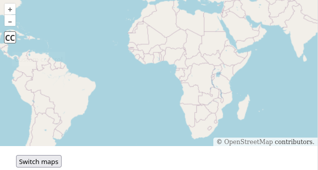

# Svelte + Vite + OpenLayers

This template should help get you started developing with Svelte in Vite with OpenLayers.

It displays either a OSM or Google base map with the default controls (Zoom) along with an example custom control.

## Key commands:

* `npn run dev` run a dev server with hot reload
* `npn run build` to create a distributable build

## Recommended IDE Setup

[VS Code](https://code.visualstudio.com/) + [Svelte](https://marketplace.visualstudio.com/items?itemName=svelte.svelte-vscode).
